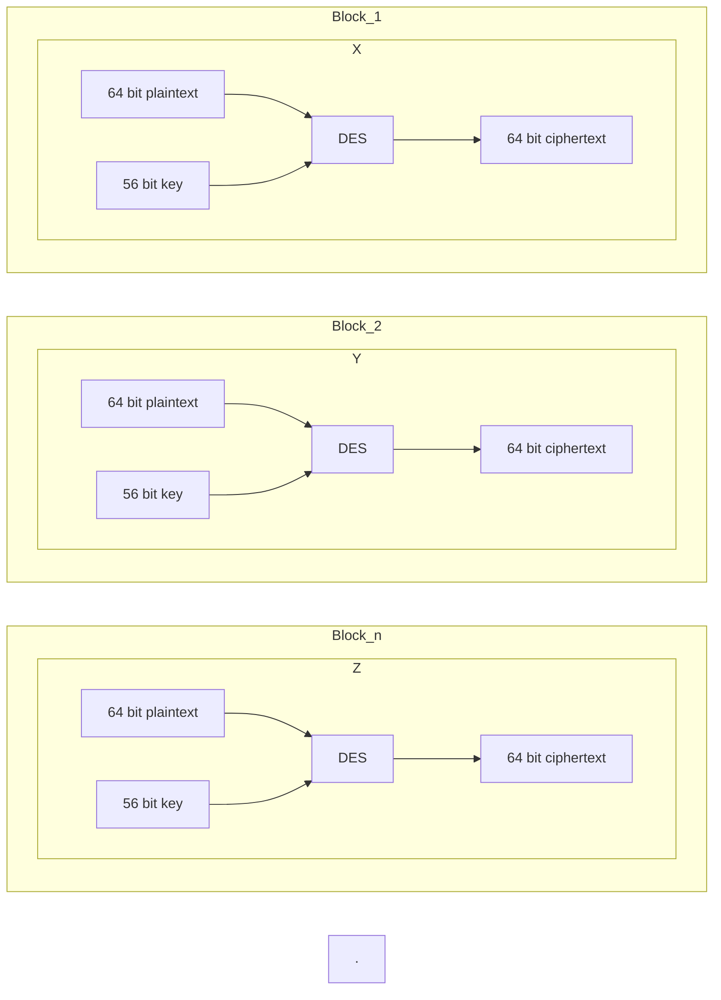

# DATA ENCRYPTION STANDARD
Data encryption standard (DES) has been found vulnerable to very powerful attacks and therefore, the popularity of DES has been found slightly on the decline. DES is a block cipher and encrypts data in blocks of size of 64 bits each, which means 64 bits of plain text go as the input to DES, which produces 64 bits of ciphertext. The same algorithm and key are used for encryption and decryption, with minor differences. The key length is 56 bits. The basic idea is shown in the figure:

We have mentioned that DES uses a 56-bit key. Actually, the initial key consists of 64 bits. However, before the DES process even starts, every 8th bit of the key is discarded to produce a 56-bit key. That is bit positions 8, 16, 24, 32, 40, 48, 56, and 64 are discarded. Thus, the discarding of every 8th bit of the key produces a 56-bit key from the original 64-bit key.

# Working of DES

DES is based on the two fundamental attributes of cryptography: substitution (also called confusion) and transposition (also called diffusion). DES consists of 16 steps, each of which is called a round. Each round performs the steps of substitution and transposition. Let us now discuss the broad-level steps in DES. 

 - In the first step, the 64-bit plain text block is handed over to an initial Permutation (IP) function.
 - The initial permutation is performed on plain text.
 - Next, the initial permutation (IP) produces two halves of the permuted block; saying Left Plain Text (LPT) and Right Plain Text (RPT).
 - Now each LPT and RPT go through 16 rounds of the encryption process.
 - In the end, LPT and RPT are rejoined and a Final Permutation (FP) is performed on the combined block
 - The result of this process produces 64-bit ciphertext.

# Why is DES unsafe?
For any cipher, the most basic method of attack is brute force, which involves trying each key until you find the right one. The length of the key determines the number of possible keys -- and hence the feasibility -- of this type of attack.

The effective DES key length of 56 bits would require a maximum of 256, or about 72 quadrillion, attempts to find the correct key. This is not enough to protect data with DES against brute-force attempts with modern computers.

Few messages encrypted using DES before it was replaced by AES were likely subjected to this kind of code-breaking effort. Nevertheless, many security experts felt the 56-bit key length was inadequate even before DES was adopted as a standard. There have always been suspicions that interference from the National Security Agency weakened the original algorithm.

DES remained a trusted and widely used encryption algorithm through the mid-1990s. However, in 1998, a computer built by the Electronic Frontier Foundation (EFF) decrypted a DES-encoded message in 56 hours. By harnessing the power of thousands of networked computers, the following year, EFF cut the decryption time to 22 hours.

Currently, a DES cracking service operated at the crack.sh website promises to crack DES keys, for a fee, in about 26 hours as of this writing. Crack.sh also offers free access to a rainbow table for known plaintexts of 1122334455667788 that can return a DES key in 25 seconds or less.

Today, reliance on DES for data confidentiality is a serious security design error in any computer system and should be avoided. There are much more secure algorithms available, such as AES. Much like a cheap suitcase lock, DES will keep the contents safe from honest people, but it won't stop a determined thief.

# Successors to DES
Encryption strength is directly tied to key size, and 56-bit key lengths have become too small relative to the processing power of modern computers. So, in 1997, NIST announced an initiative to choose a successor to DES and undertook a five-year evaluation process of 15 encryption algorithms. In 2001, NIST selected the Rijndael cipher, and with some tweaks, it became the new AES.

Data Encryption Standard (FIPS 46-3) was officially withdrawn in May 2005. Triple DES (3DES), a variant of DES that can use up to three different keys for greater effective key length, has also been deprecated. 3DES performs three iterations of the DES algorithm; the strongest version of 3DES uses a different key for each iteration, increasing the effective key length to 168 bits. However, due to the likelihood of a meet-in-the-middle attack, the effective security it provides is only 112 bits. 3DES encryption is slower than plain DES.

# How is DES used today?
As deprecated standards, both the DES and 3DES algorithms and key lengths could still be used. However, users must accept that there is a security risk in using the deprecated algorithm and key length and that the risk will increase over time.

DES is no longer trusted for encrypting sensitive data. Before it was deprecated and eventually disallowed, the standard was required for U.S. government financial transactions that used electronic funds transfer. It became the default encryption algorithm used in financial services and other industries.

**DES** and **3DES** continue to be used in limited ways.

**3DES**. NIST guidance for 3DES will change to disallowed in 2023. At that point, the algorithm and key length will not be used for cryptographic protection.

**Cryptographic training**. DES and its variants continue to be used today for teaching about cryptography. The algorithms are well understood, and there is a significant body of research into both how effective DES can be and how to effectively attack it. The technology is still used in academia to demonstrate the fundamentals of digital cryptography, including the following:

 - substitution and permutation of ciphertexts;
 - techniques for applying keys and how to find them; and
 - exploiting weaknesses in cryptographic algorithms.
