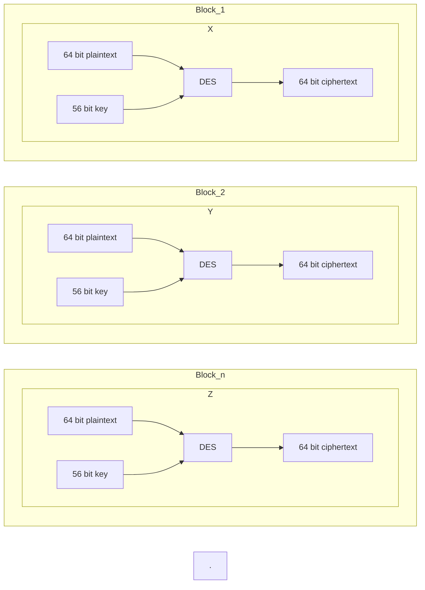

# DATA ENCRYPTION STANDARD
Data encryption standard (DES) has been found vulnerable to very powerful attacks and therefore, the popularity of DES has been found slightly on the decline. DES is a block cipher and encrypts data in blocks of size of 64 bits each, which means 64 bits of plain text go as the input to DES, which produces 64 bits of ciphertext. The same algorithm and key are used for encryption and decryption, with minor differences. The key length is 56 bits. The basic idea is shown in the figure:

