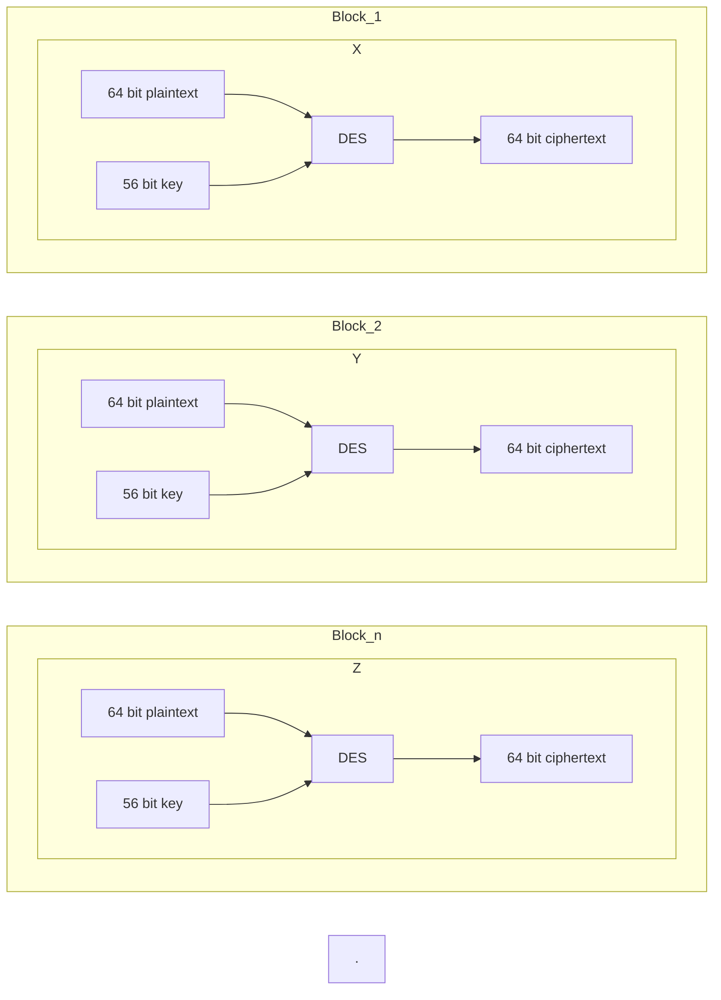

# DATA ENCRYPTION STANDARD
Data encryption standard (DES) has been found vulnerable to very powerful attacks and therefore, the popularity of DES has been found slightly on the decline. DES is a block cipher and encrypts data in blocks of size of 64 bits each, which means 64 bits of plain text go as the input to DES, which produces 64 bits of ciphertext. The same algorithm and key are used for encryption and decryption, with minor differences. The key length is 56 bits. The basic idea is shown in the figure:

We have mentioned that DES uses a 56-bit key. Actually, the initial key consists of 64 bits. However, before the DES process even starts, every 8th bit of the key is discarded to produce a 56-bit key. That is bit positions 8, 16, 24, 32, 40, 48, 56, and 64 are discarded. Thus, the discarding of every 8th bit of the key produces a 56-bit key from the original 64-bit key.

# Working of DES

DES is based on the two fundamental attributes of cryptography: substitution (also called confusion) and transposition (also called diffusion). DES consists of 16 steps, each of which is called a round. Each round performs the steps of substitution and transposition. Let us now discuss the broad-level steps in DES. 

 - In the first step, the 64-bit plain text block is handed over to an initial Permutation (IP) function.
 - The initial permutation is performed on plain text.
 - Next, the initial permutation (IP) produces two halves of the permuted block; saying Left Plain Text (LPT) and Right Plain Text (RPT).
 - Now each LPT and RPT go through 16 rounds of the encryption process.
 - In the end, LPT and RPT are rejoined and a Final Permutation (FP) is performed on the combined block
 - The result of this process produces 64-bit ciphertext.

